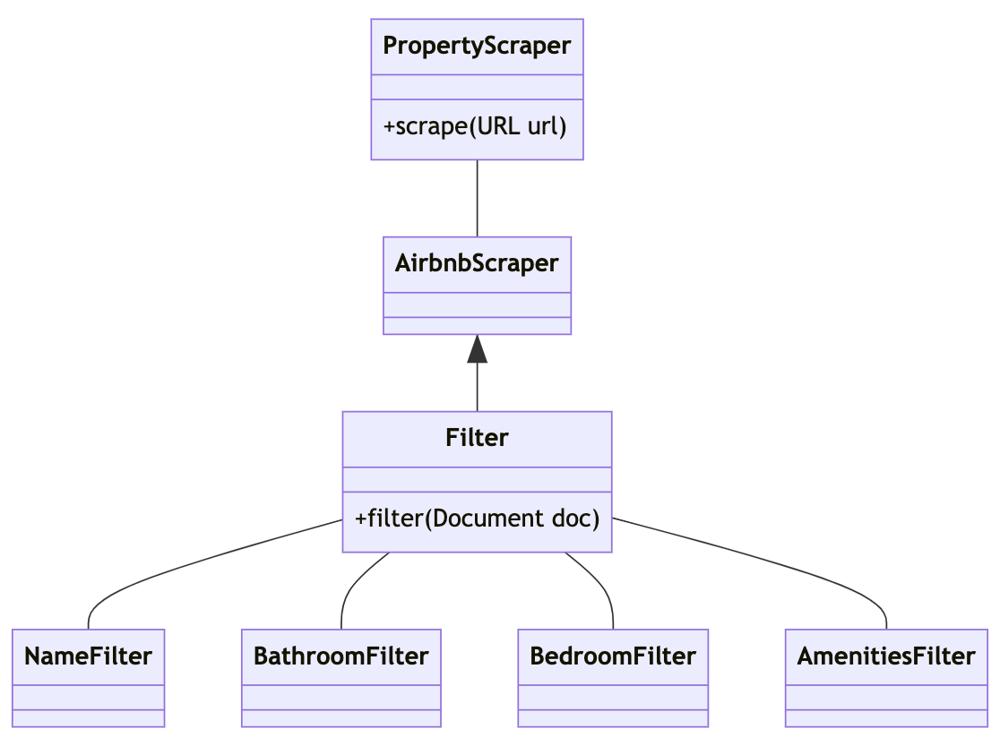

# airbnb-scraper

# Input
https://www.airbnb.co.uk/rooms/33571268

https://www.airbnb.co.uk/rooms/20669368

https://www.airbnb.co.uk/rooms/50633275

# Output
```json
[
  {
    "url": "https://www.airbnb.co.uk/rooms/33571268",
    "attributes": []
  },
  {
    "url": "https://www.airbnb.co.uk/rooms/20669368",
    "attributes": [
      {
        "name": "title",
        "value": "Little Country Houses - Poppy's Pad with hot tub"
      },
      {
        "name": "bedrooms",
        "value": "1 bedroom"
      },
      {
        "name": "bathrooms",
        "value": "1 bathroom"
      },
      {
        "name": "type",
        "value": "Tiny home"
      },
      {
        "name": "amenities",
        "value": "[Kitchen, Free parking on premises, Hot tub, Patio or balcony, Indoor fireplace, Refrigerator, Long-term stays allowed, Unavailable: Carbon monoxide alarm Carbon monoxide alarm]"
      }
    ]
  },
  {
    "url": "https://www.airbnb.co.uk/rooms/50633275",
    "attributes": [
      {
        "name": "title",
        "value": "Lovely loft on the beautiful North Norfolk Coast"
      },
      {
        "name": "bedrooms",
        "value": "1 bedroom"
      },
      {
        "name": "bathrooms",
        "value": "1 bathroom"
      },
      {
        "name": "type",
        "value": "Entire guest house"
      },
      {
        "name": "amenities",
        "value": "[Wifi, Free parking on premises, Hair dryer, Microwave]"
      }
    ]
  }
]
```

# Build Instructions

## Prerequisite
* Java 17

## Build
```bash
make build
```

## Run
```bash
make run
```

# Design Decisions


* The code for scraping airbnb sites is abstracted behind the Scraper interface. 
This will allow for the code to be extended for other websites without needed to change any
of the internals of AirbnbScraper.

* The AirbnbScraper contains a handful of filters. Again, abstracted behind the filter interface 
So that we can add more filters without needing to modify the code in the scrape method.

* The Filters are package private to the airbnb package as they are an implementation detail of the 
airbnb package and not for general use. 

# TODO given production setting
* The values of the attributes aren't well very parsed. I would probably spend more time on the parsing so that the output json looks a bit better.  
* I will add more extensive testing. Preferably an integration test and unit test for the AirbnbScraper as currently there are only unit tests for the filters.
* Error handling is very minimal. I would add some more extensive exception handling and based on the errors
relay appropriate information to the output.
* I would add structured logging for any exceptions that occur and are handled.
* Currently, the inputs are hardcoded. I would change this to allow passing in urls as user input.
* Library classes are being passed between layers e.g. `WebDriver` and `Document`, I would abstract these 
behind a model of our own making. This will we are able to hide implementation details and can control the information that
is passed between layers more carefully. 

# Unfinished Work
* I wanted to run the application within a docker container so that people didn't need to have Java
installed on their machines but I did not have time to debug the network issues within docker. When running 
through docker it can't render the pages properly. 

